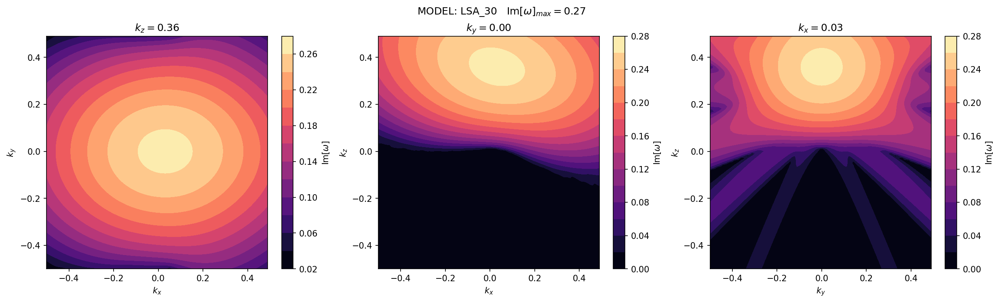

# LiSA_FFC
Linear Stability analysis for Neutrino Fast Flavor Conversion.

Check the examples (jupyter notebooks in the examples folder) for more details about the usage.

Check the [plot_lsa_results](./examples/plot_lsa_results.ipynb) notebook to see how to load the results.

The mathematical formulation of the normal mode analysis for FFC-3D can be found [here](nma_FFC_3D__theory.pdf).

### Colormap plot of the output from 3D FFC is shown below.

